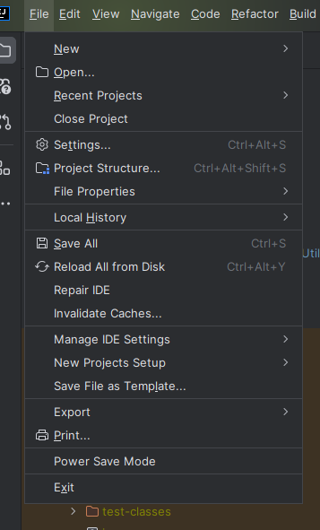
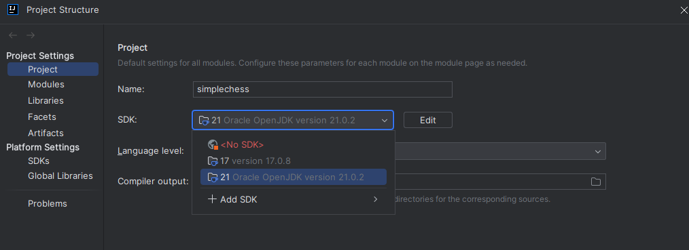
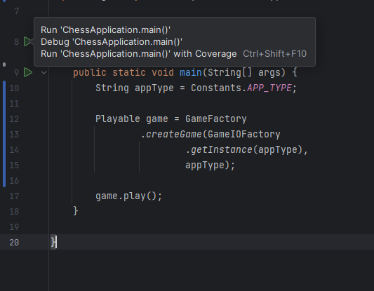
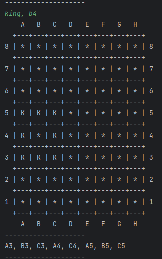

# Chess Game Simulation
This is a simple console-based chess game simulation built with Java 21. 
The application allows players to input a chess piece and its position, then calculates the possible moves based on the piece type and current position.

## Requirements
- Java Development Kit (JDK) 21/17
- A terminal or IDE to run the program (e.g., IntelliJ IDEA, Eclipse, or VS Code)
- Maven (optional, if you want to build the project)

## Setup Instructions
- Clone the Repository 
  - git clone https://github.com/satya-indra/simplechess.git
  - cd <project-folder>
- Install and verify JDK 21. Above 17 is also fine. Update 17 in pom.xml in that case.
  - java --version
  - output : 
    - openjdk 21 2023-09-19 
    - OpenJDK Runtime Environment ...
- Make sure to select JDK21 in Project Structure
  - 
  - 
- Compile and Run the Program using IDE
  - Go to ChessApplication and click on Play next to class name.
  - 

## Requirements:
1. User enter piece name and position. Example : KING, B4.
2. Our task is to find and print all possible places the piece can go from there.

## Output

## Components

### 1. **Board**
- **Responsibilities**:
    - Manages the state of the board (e.g., initialization, reset).
    - Provides utility methods like display.

- **Key Methods**:
    - `displayBoard()`: Displays the board in a grid format.

### 2. **Piece**
- **Responsibilities**:
    - Encapsulates movement rules for each type of piece.
    - Provides utility methods like boundary checks and move validation.
    - Provides offsets for valid moves.

- **Key Classes**:
    - `King`: Defines movement for the king.
    - `Queen`, `Pawn`, etc.: Other chess pieces with their specific logic.

### 3. **Game**
- **Abstract Class**:
    - Defines common behavior and properties like `Board` and `GameIO`.
    - Declares the abstract method `play()` to be implemented by specific game modes.

- **Derived Classes**:
    - `ConsoleGame`: Implements `play()` for console interaction.
    - `WebGame`: (Future Enhancement) Implements web-based interaction (e.g., handling HTTP requests).

### 4. **GameIO**
- **Interface**:
    - Handles input/output for different game modes.

- **Implementations**:
    - `ConsoleIO`: Reads input from the console and writes output.
    - `WebIO`: (Future Enhancement) Processes web requests and responses.

### 5. **InputParser**
- **Responsibilities**:
    - Validates user input against defined patterns.
    - Parses input into a `UserInput` object.

- **Modularity**:
    - Supports different implementations for console and web modes.

---

## Workflow

1. **Initialization**:
    - `GameFactory` creates an instance of the desired game type (`ConsoleGame` or `WebGame`).
    - The `Game` instance initializes the `Board` and other dependencies.

2. **Input Handling**:
    - Input is read via `GameIO` (console or web).
    - `InputParser` validates and parses the input into a `UserInput` object.

3. **Move Computation**:
    - The `Piece` computes valid moves for the given piece and position.
    - Movement logic uses offsets defined in each `Piece` class.

4. **Output**:
    - The board is updated with the piece’s valid moves.
    - Output is displayed via `GameIO`.

---

## Enhancements

### Future Improvements
1. **Multiplayer Support**:
    - Extend `Game` to handle multiple players.
    - Add synchronization mechanisms for real-time games.

2. **Game Variants**:
    - Support variants like timed chess or custom boards.

3. **Persistence**:
    - Save and load game states to/from a database or file.

4. **AI Integration**:
    - Add AI for single-player mode.

5. **UI Enhancements**:
    - Replace console-based output with a graphical interface.